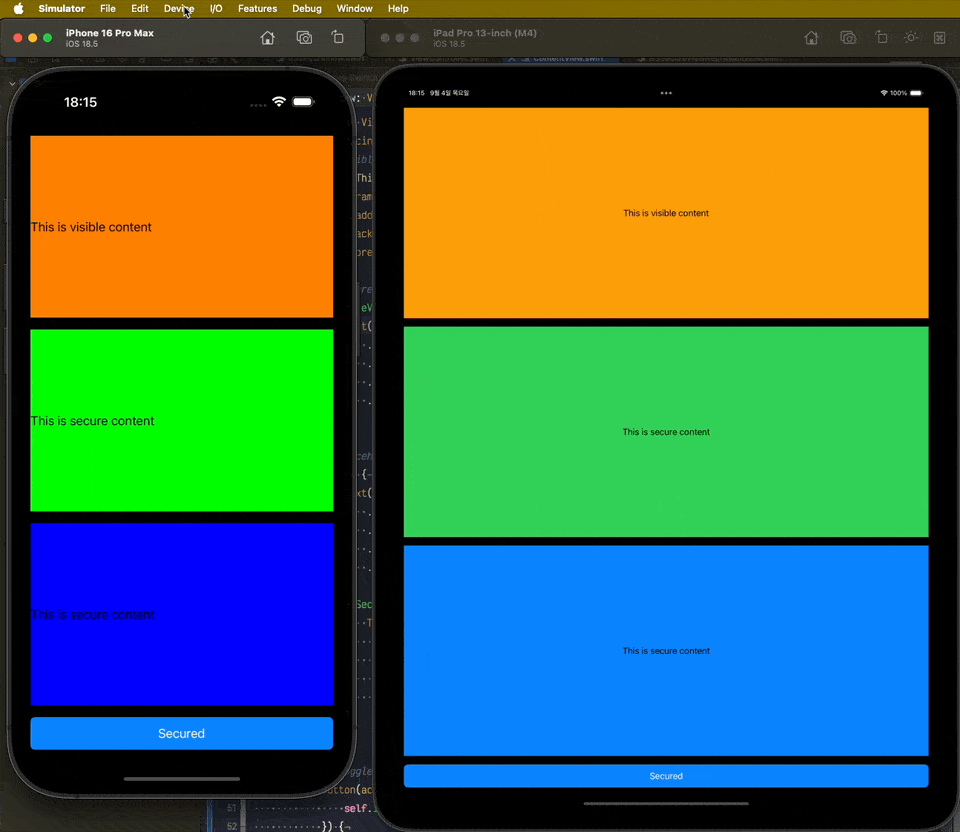

# BSSecureKit

[](https://cocoapods.org/pods/BSSecureKit)
[](https://swift.org/package-manager/)
[](https://developer.apple.com/ios/)
[](https://swift.org/)
[](LICENSE)

BSSecureKit is a secure view component library for iOS applications that protects sensitive content from screenshots and screen recordings. It provides components for both UIKit and SwiftUI frameworks.

## Demo



## Screenshot

| Physical Device | iOS Simulator |
|----------------|---------------|
|  |  |

## Key Features

- **Secure Overlay**: Protects sensitive content from screenshots and screen recordings
- **iOS 13.0+ Support**: Compatible with the latest iOS versions (tested up to iOS 26.0 beta 9)
- **UIKit & SwiftUI Support**: Works with both frameworks
- **Simple Usage**: Minimal code required to implement security features

## Important Notes

⚠️ **Device Limitation**: This library only works on iOS physical devices. It does not function on iOS Simulator or Mac devices due to the nature of the security implementation.

## Installation

### Swift Package Manager

```swift
dependencies: [
    .package(url: "https://github.com/Bangs00/BSSecureKit.git", from: "1.0.0")
]
```

### CocoaPods

```ruby
pod 'BSSecureKit', '~> 1.0.0'
```

### Manually

You can clone the repository or download the ZIP file and add it directly to your project.

## Usage

### UIKit Implementation

```swift
import BSSecureKit

// Basic usage
let secureView = BSSecureView()
let contentLabel = UILabel()
contentLabel.text = "Sensitive Information"
secureView.embed(contentLabel)

// With placeholder
let placeholderView = UIView()
let placeholderLabel = UILabel()
placeholderLabel.text = "Placeholder"

let secureView = BSSecureView()
let secureLabel = UILabel()
secureLabel.text = "Actual Sensitive Information"
secureView.embed(secureLabel)

placeholderView.addSubview(placeholderLabel)
placeholderView.addSubview(secureView)
```

### SwiftUI Implementation

```swift
import SwiftUI
import BSSecureKit

struct SecureContentView: View {
    var body: some View {
        VStack {
            // Regular content
            Text("Regular Content")
                .padding()
                .background(Color.orange)
            
            // Secure content
            BSSecureViewRepresentable {
                Text("Sensitive Information")
                    .padding()
                    .background(Color.green)
            }
            
            // Placeholder with secure content
            ZStack {
                Text("Placeholder")
                    .padding()
                    .background(Color.red)
                
                BSSecureViewRepresentable {
                    Text("Actual Sensitive Information")
                        .padding()
                        .background(Color.blue)
                }
            }
        }
        .padding()
    }
}
```

## Example Projects

This repository includes two example projects:

- **Example-UIKit**: UIKit implementation example
- **Example-SwiftUI**: SwiftUI implementation example

Each example demonstrates:
- Comparison between regular and secure content
- Basic secure view usage
- Combination of placeholder and secure content

## Requirements

- iOS 13.0+ (tested up to iOS 26.0 beta 9)
- Swift 5.0+
- Xcode 12.0+
- **iOS Physical Device** (does not work on iOS Simulator or Mac)

## Testing

This library has been tested on:
- iOS 13.0 through iOS 26.0 beta 9
- Both UIKit and SwiftUI implementations

**Note**: The security features only work on physical iOS devices. When testing on iOS Simulator or Mac, the secure overlay will not function as expected.

## License

This project is licensed under the MIT License. See the [LICENSE](LICENSE) file for details.

## Contributing

Bug reports, feature requests, and pull requests are welcome!